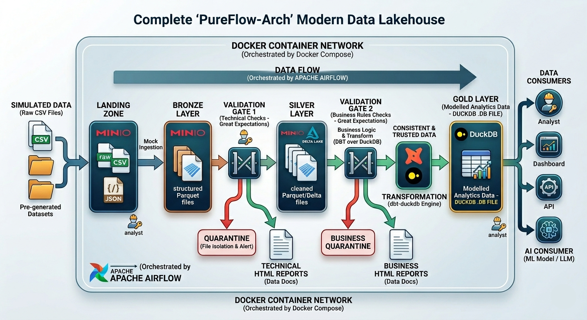
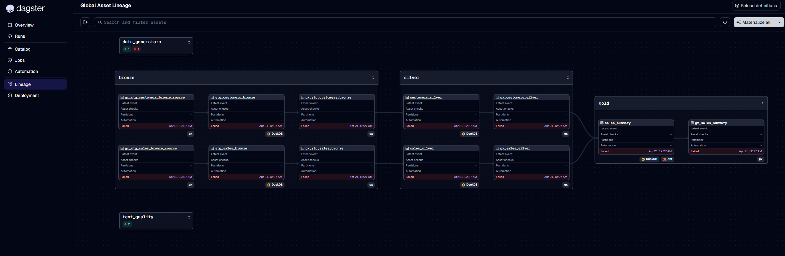
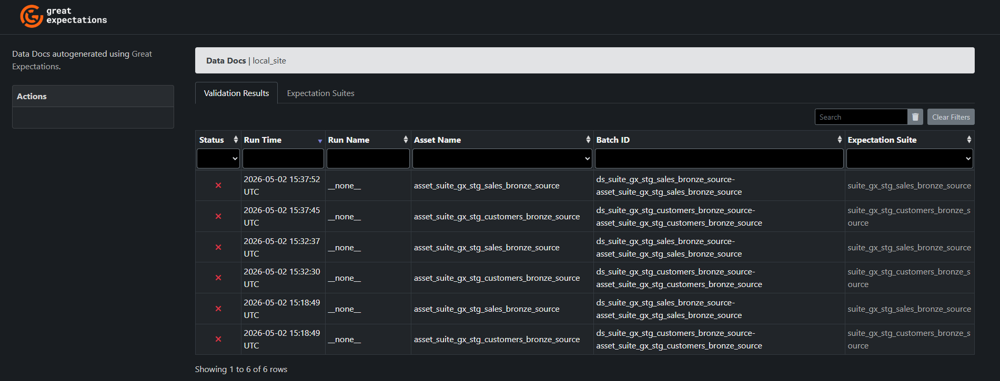
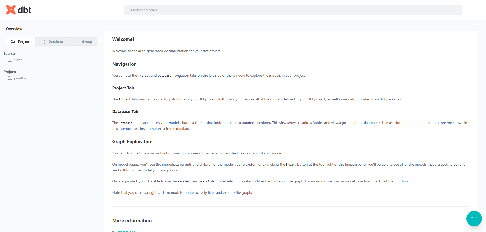
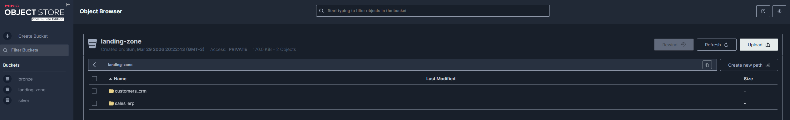

# PureFlow-Arch: Modern & Modular Data Lakehouse
### Data Engineering Capstone Project (TCC) - Medallion Architecture

**PureFlow-Arch** is a high-performance, **metadata-driven** data engineering platform. It implements a full Medallion Architecture using a 100% open-source stack, featuring a custom **Factory Pattern** for pipeline generation, integrated Data Quality (GX), and a robust DataOps CI/CD lifecycle.

---

## 🏗️ Architecture & Design Principles

The project is built on **Clean Architecture** and **SOLID** principles, ensuring that infrastructure, execution logic, and business rules are strictly decoupled.

### 1. Medallion Layers (S3-Native)
Data evolves through progressive layers in **MinIO (S3)**:
*   **Landing (Raw):** Source files (CSV/JSON) in their original format.
*   **Bronze (Standardized):** Technical ingestion (Schema enforcement) using **DuckDB**.
*   **Silver (Validated & Clean):** High-quality data after **Great Expectations** gates and SQL transformations.
*   **Gold (Business Ready):** Aggregated datasets managed by **dbt**, ready for BI consumption.

### 2. The DataPipeline Factory (Innovation)
Instead of hardcoding every step, the project uses a **Factory Pattern** (`DataPipelineFactory`). This abstraction allows developers to define complex pipelines in Python using a simple, declarative DSL:
*   **Automatic Lineage:** Dependencies are inferred and mapped natively in **Dagster**.
*   **Decoupled SQL:** Business logic is stored in pure `.sql` files, separate from the execution engine.
*   **Dynamic Quality Gates:** Validation rules are injected into the pipeline at runtime.

---

## 🛠️ Tech Stack & Ecosystem

*   **Orchestration:** [Dagster](https://dagster.io/) (Asset-Based, Modern Orchestrator)
*   **Storage:** [MinIO](https://min.io/) (High-performance S3-Compatible Storage)
*   **Processing:** [DuckDB](https://duckdb.org/) (The "SQLite for Analytics" - Local-first OLAP)
*   **Quality:** [Great Expectations](https://greatexpectations.io/) (Dynamic Data Validation)
*   **Modeling:** [dbt](https://www.getdbt.com/) (Modular SQL transformations for the Gold Layer)
*   **DataOps:** GitHub Actions (Automated Linting, Security, and Testing)
*   **Environment:** Docker & Poetry (Python 3.12)

---

## 📂 Project Structure

```text
PureFlow-Arch/
├── .github/workflows/      # CI/CD DataOps Pipelines
├── dbt/                    # dbt Project (Gold Layer Models)
├── src/
│   ├── core/               # Shared Engine, Factory, Connection & Quality logic
│   ├── pipelines/          # Declarative Pipeline Definitions (Sales, Customers)
│   ├── sql/                # Pure SQL Transformation Logic (Separated from code)
│   ├── validation/         # Generic GX Validation Wrapper
│   └── orchestration.py    # Dagster Entrypoint & UI Definitions
├── tests/                  # Unit tests for core logic and generators
└── pyproject.toml          # Centralized Project Metadata & Config
```

---

## 🚀 Getting Started

### 1. Prerequisites
*   Docker & Docker Compose
*   Poetry (Optional for local development)

### 2. Launch the Platform
```bash
docker-compose up -d --build
```

### 3. Monitoring & Access
| Tool | Endpoint | Description |
| :--- | :--- | :--- |
| **Dagster UI** | [http://localhost:3000](http://localhost:3000) | Pipeline Lineage & Execution |
| **Streamlit** | [http://localhost:8501](http://localhost:8501) | Business Insights Dashboard |
| **dbt Docs** | [http://localhost:8081](http://localhost:8081) | Data Documentation & Catalog |
| **GX Reports** | [http://localhost:8082](http://localhost:8082) | Data Quality HTML Reports |
| **MinIO Console** | [http://localhost:9001](http://localhost:9001) | S3 Object Browser |

---

## 📂 Documentation & Visuals

The project architecture and interface previews:

### 🏗️ Architecture Diagram

*High-level overview of the Medallion flow and technology stack.*

### 🚀 Dagster UI (Orchestration)

*Preview of the asset-based orchestration, lineage, and Metadata Plots.*

### 🧪 Data Quality Reports (GX)

*Detailed HTML reports generated by Great Expectations, served via HTTP.*

### 📖 dbt Documentation

*Model lineage and documentation generated by dbt.*

### 📦 MinIO Console (S3 Storage)

*S3-compatible storage browser showing the medallion buckets.*

---

## 🛡️ DataOps & Quality Control

The project implements a mandatory **Quality Gate** before any data reaches the Silver/Gold layers:
1.  **Linting:** `pylint` and `sqlfluff` ensure code and SQL standards.
2.  **Security:** `bandit` scans for vulnerabilities in the code.
3.  **Validation:** Every asset is checked by **Great Expectations**. 
    *   **Observations:** Failed validations are recorded as `AssetObservation` in Dagster, preserving the report link even on failure.
    *   **Plots:** Numerical validation scores enable historical tracking via Dagster's Metadata Plots.
4.  **Testing:** `pytest` validates the underlying generators and core utilities.

---
*Developed as a Modular Data Platform for Senior Engineering Capstone.*
